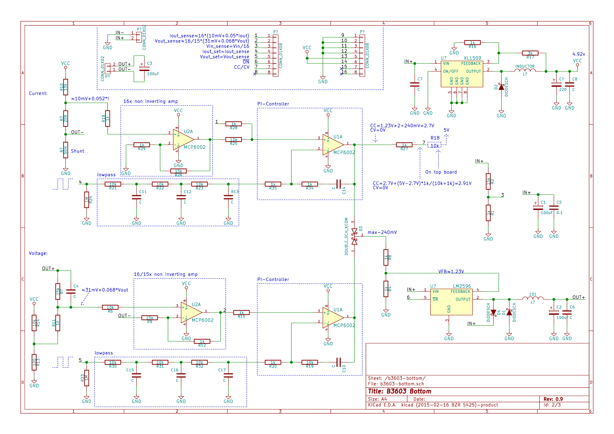
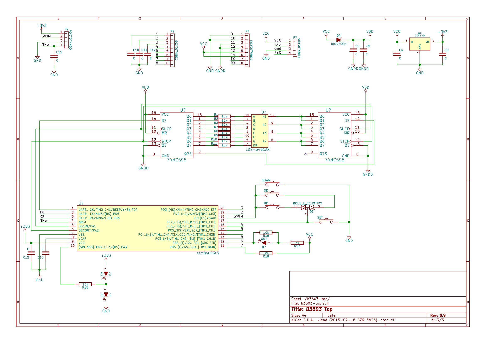
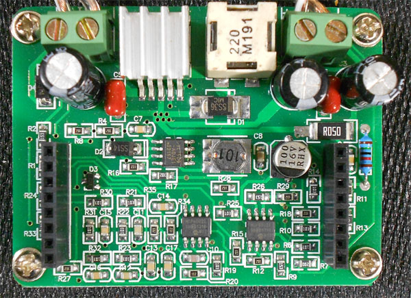
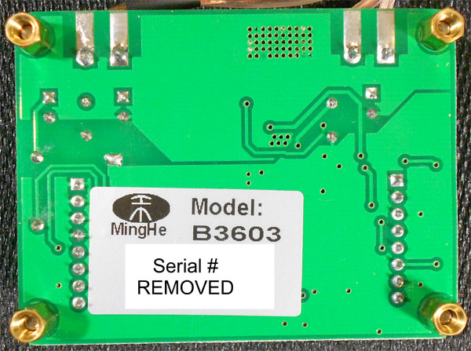
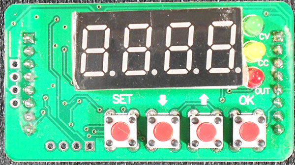
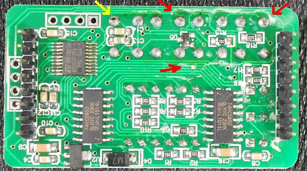
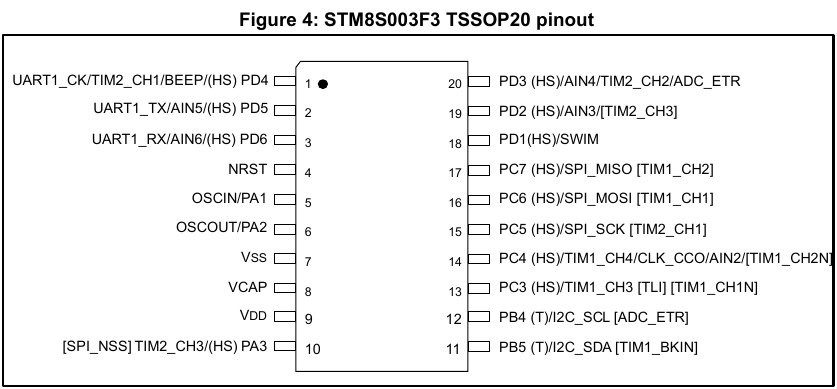

# Yet another alternate firmware b3603 powersupply

This firmware is an attempt to complete the b3603 firmware written by baruch.

## Schematics

Bottom board schematics:

Top board schematics:

## Regulator Board (bottom)

## Control Board (top)

## HARDWARE USED

- STLINK V2
- B3603 Board
- CH340 usb to ttl converter with 2014 drivers

> Note : The 2023 driver for CH340 has issues so prefer using the 2014 driver as it works perfectly.

## Software needed

* VS Code with Platform io installed.
OR 
* ST visual programmer (for flashing only)

## MCU

The MCU is an [STM8S003F3](http://www.st.com/web/catalog/mmc/FM141/SC1244/SS1010/LN2/PF251792). It is the TSSOP-20 package.

## Pinouts

Lets name the different pinout components, left and right are as seen looking at the top board with the 7-segment display up:

* MCU
* Left connector -- 8 pins left side
* Right connector -- 8 pins right side
* Serial connector -- 4 pins at left most side
* SWIM connector -- 4 pins at the bottom, just left of the buttons
* 74HC595 #1 -- The one closest to the MCU
* 74HC595 #2 -- The one furthest from the MCU

## Pinout from MCU

| MCU pin | MCU Function | Board Connector | Board Connector Pin | Board Connector Name
| ------- | -------------|-----------------|---------------------|-----
| Pin 1 | UART1\_CK/TIM2\_CH1/BEEP/(HS) PD4 | 74HC595 | Pin 3 | DS
| Pin 2 | UART1\_TX | Serial connector | Pin 2 | TX
| Pin 3 | UART1\_RX | Serial connector | Pin 4 | RX
| Pin 4 | NRST | SWIM | Pin 1 | SWIM NRST
| Pin 5 | OSCIN/PA1 | 74HC595 | Pin 11 | SHCP
| Pin 6 | OSCOUT/PA2 | 74HC595 | Pin 12 | STCP
| Pin 7 | Vss (GND) | | |
| Pin 8 | Vcap | | |
| Pin 9 | Vdd | | |
| Pin 10 | SPI\_NSS / TIM2\_CH3 / PA3 (HS) | CV/CC leds |  | CV/CC leds
| Pin 11 | PB5 (T) / I2C\_SDA / TIM1\_BKIN | Left connector | Pin 7 | CV/CC status
| Pin 12 | PB4 (T) / I2C\_SCL / ADC\_ETR | Left connector | Pin 6 | Enable Output + Red (ON) led
| Pin 13 | PC3 (HS) / TIM1\_CH3 [TLI] [TIM1_CH1N]| Left Connector | Pin 8 | Not connected
| Pin 14 | PC4 (HS) / TIM1\_CH4 / CLK\_CCO / AIN2 / TIM1\_CH2N | Left connector | Pin 1 | Iout sense 16\*(0.01V + Iout\*0.05)
| Pin 15 | PC5 (HS) / SPI\_SCK / TIM2\_CH1 | Left connector | Pin 5 | Vout set
| Pin 16 | PC6 (HS) / SPI\_MOSI / TIM1\_CH1 | Left connector | Pin 4 | Iout set
| Pin 17 | PC7 (HS) / SPI\_MISO / TIM1\_CH2 | Button |  | Buttons
| Pin 18 | PD1 (HS) / SWIM | SWIM | Pin 3 | SWIM & Buttons
| Pin 19 | PD2 (HS) / AIN3 / TIM2\_CH3 | Left connector | Pin 2 | Vout sense
| Pin 20 | PD3 (HS) / AIN4 / TIM2\_CH2 / ADC\_ETR | Left connector | Pin 3 | Vin sense (Vin/16)

The buttons are connected in a strange setup where all four are on two pins.

The CV/CC leds are in serial with a lead between them throuh a 10K resistor to pin PA3, by changing the pin between Output HIGH, Output LOW and Input it is possible to make one of them on or both off.

## How to upload

1. Download ST visual Programmer and flash the ihx file using it.
1. You will need to set the AFR0 flag of OPT2 byte to 1 in the option bytes tab.
1. Now perform a Program operation.

## How to upload and get started with development

1. Download platform io and create a new project with board as stm8s003f3 , platform as stpl(although we havent used any of the libraries as of yet)
1. You will also need st visual programmer for some of the steps.
1. Next connect the st link and upload the program
1. Perform a read operation in STVP
1. Now you will need to set the AFR0 flag of OPT2 byte to 1 using stvp.
1. Now perform a Program operation

## Error Codes

- E000 -> AFR0 optionbyte not set in stvp

## ACKNOWLEDGMENT

A very special thanks to @baruch as he was the original creator of this Firmware and did most of the work.  

Also thanks to @UsrnameTaken , would be using his b3606 code to decrease the size of my code.  

[b3606 memory efficient Firmware by UsrnameTaken](https://github.com/UsrnameTaken/B3606)  

[b3603 Firmware by Baruch](https://github.com/baruch/b3603)

## bugs

- the afr flag is not able to be set from flag as the uart_flush_writes function never returns back.

## changes

- buttons working

## Functions

### Main.c

- iwatchdog_init() -> void
- iwatchdog_tick() -> void
- commit_output() ->void
- set_name(uint8_t* name) ->void
- autocommit() ->void
- set_output(uint8_t* s) ->void
- set_voltage(uint8_t* s) ->void
- set_current(uint8_t* s) ->void
- set_autocommit(uint8_t* s) ->void
- write_str(const char* prefix , const char* val) ->void
- write_onoff(const char* prefix , uint8_t on) ->void
- write_millivolt(const char* prefix , uint16_t mv) ->void
- write_milliamp(const char* prefix , uint16_t ma) ->void
- write_int(const char* prefix , uint16_t val) ->void
- _parse_uint(uint8_t* s) ->uint32_t
- process_input() ->void
- clk_init() ->void
- pinout_init() ->void
- config_load() ->void
- read_state() ->void
- ensure_afr0_set() ->void
- detect_button_press() ->void

## Interfaces

### Button Interface

- press OK button set output 1.
- press OK button when output is on to cycle through parameters
- press SET when output on to turn off output
- when output is on or off you can change voltage/current values using up and down buttons.
- for change of settings like OCP , OVP , default output state use the UART protocol

### UART Interface

#### Configuration

The serial works at 38400 8N1, the low speed is intended to allow MCU to handle
the flow without interfering too much with the rest of the work.

#### Startup

The controller will send a welcome message "B3603 alternative firmware vX.XX"

#### Commands

All commands are line-feed or carriage-return terminated, if the input buffer
is filled with no LF or CR character the entire line is dumped and a message is
sent on the output to indicate this failure.

##### Model Query

* Send: "MODEL"
* Receive: "MODEL: B3603"

This is just the model information, it is fixed for this firmware at this time
as it only runs on a single device. There is however another device that seems
to use the same controller board and then the model returned may be different.

##### Version Query

* Send: "VERSION"
* Receive: "VERSION: X.X.X"

##### System Configuration Query

* Send: "SYSTEM"
* Receive: "SYSTEM:\r\nMODEL: <model>\r\nVERSION: <version>\r\nNAME: <name>\r\nONSTARTUP: <ON/OFF>\r\nAUTOCOMMIT: <YES/NO>\r\n"

Get the system information: model, version, name, auto-on on startup and auto commit.

##### Commit configuration

* Send: "COMMIT"
* Receive: "COMMIT: DONE\r\n"

If auto commit is off this command will change the operating parameters according to the changes done since the last commit.
If auto commit is on, this command is not going to change anything.

##### Auto-commit Set

* Send: "AUTOCOMMIT <YES/NO>"
* Receive: "AUTOMMIT: YES" or "AUTOCOMMIT: NO"

Set the auto commit setting.

##### Name Set

* Send: "SNAME"
* Receive: "SNAME: <name>"

Set the name to what the user gave. The size is limited to 16 characters and
they must be printable characters.

##### Calibration Values

* Send: "CALIBRATION"
* Receive: detailed on calibration, mostly useful to debug and comparison of units

##### Voltage Capabilities Query

* Send: "VLIST"
* Receive: "VLIST: 1.0000/12.0000/0.0001"

Returns minimum voltage, maximum voltage and step size.

##### Current Capabilities Query

* Send: "CLIST"
* Receive: "CLIST: 0.001/3.000/0.001"

Returns minimum current, maximum current and step size.

##### Output Enable/Disable

* Send: "OUTPUT 0" or "OUTPUT 1"
* Receive: "OUTPUT: DISABLED" or "OUTPUT: ENABLED"

OUTPUT0 disables the output and OUTPUT1 enables the output.

##### Voltage Set

* Send: "VOLTAGE X.XXXX"
* Receive: "VOLTAGE: SET X.XXXX"

Set the maximum voltage level.

##### Current Set

* Send: "CURRENT X.XXXX"
* Receive: "CURRENT: SET X.XXXX"

Set the maximum current level.

##### Default at startup

* Send: "DEFAULT 0" or "DEFAULT 1"
* Receive: "DEFAULT: DISABLED" or "DEFAULT: ENABLED"

Set the default for the output at startup, either enabled or disabled.

Default disabled is better for safety, default enabled is useful when the unit
powers an always on device and needs to always work without a manual
intervention when the power comes back after a power outage.

##### Over voltage protection

* Send: "VSHUTDOWN X.XXXX" or "VSHUTDOWN 0"
* Receive: "VSHUTDOWN: X.XXXX" or "VSHUTDOWN: DISABLED"

When a VSHUTDOWN is set and reached the unit will turn off the output to avoid
an over-voltage situation. This would be used in a constant current situation
by setting the shutdown voltage lower than the max controlled voltage and let
the microcontroller shutdown the entire output if the limit is reached.

##### Over current protection

* Send: "CSHUTDOWN 1" or "CSHUTDOWN 0"
* Receive: "CSHUTDOWN: ENABLED" or "CSHUTDOWN: DISABLED"

When a CSHUTDOWN is set and reached the unit will shutdown, current overload is
considered when we reach the maximum current and the voltage drops by 10%
already to handle the current control, at that point it is assumed the load is
in short and the output is shutdown.

##### Query configuration

* Send: "CONFIG"
* Receive: "CONFIG:\r\nOUTPUT: <Output>\r\nVOLTAGE SET: <Voutmax>\r\nCURRENT SET: <Ioutmax>\r\nVOLTAGE SHUTDOWN: <Vshutdown>\r\nCURRENT SHUTDOWN: <Cshutdown>\r\n"

Report all the config variables:

* Output -- Output enabled "ON" or disabled "OFF"
* Voutmax -- Voltage output maximum
* Ioutmax -- Current output max as set
* Vshutdown -- Voltage set for shutdown, or "DISABLED" for feature disabled
* Cshutdown -- Current shutdown enabled "ON" or disabled "OFF"

##### Status Report

* Send: "STATUS"
* Receive: "STATUS:\r\nOUTPUT: <Output>\r\nVOLTAGE IN: <Vin>\r\nVOLTAGE OUT: <Vout>\r\nVOLTAGE OUT: <Iout>\r\nCONSTANT: <CCCV>\r\n"

Reports all state variables:

* Output -- Output enabled "ON" or disabled "OFF"
* Vin -- Voltage Input to the unit
* Vout -- Actual voltage output
* Iout -- Actual current output
* CCCV -- "CURRENT" if we are in constant current, "VOLTAGE" if we are in constant voltage

## Missing features

* Calibration
* Lock keys
* Save settings to EEPROM, also load them at startup
* Watchdog, can we output something on the serial?
* Internal notification logic, monitor the output values and notify immediately
  on non-trivial change (i.e. apply hysteresis so minutiae errors are not
  noisy)
